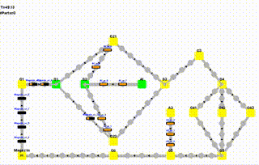

# LineFlow

[](https://pypi.org/project/lineflow-rl/)

`LineFLow` is a python framework to simulate assembly lines. It allows to model
arbitrary discrete part assembly lines and provides an `gymnasium` environment to
optimize them with reinforcement learning. The documentation can be
found [here](https://hs-kempten.github.io/lineflow/).


# Install

Install with

```bash
pip install lineflow-rl
```

# Examples


## Visualization 
This is how an assembly line can be implemented and visualized:


```python
from lineflow.simulation import Line, Source, Sink, Process

class SimpleLine(Line):

    def build(self):

        # Set up stationary objects
        source = Source(
            name='Source',
            processing_time=5,
            position=(100, 500),
            unlimited_carriers=True,
        )

        process = Process('Process', processing_time=6, position=(350, 500))
        sink = Sink('Sink', processing_time=3, position=(600, 500))
        
        # Wire them with buffers
        source.connect_to_output(station=process, capacity=3)
        process.connect_to_output(station=sink, capacity=2)


line = SimpleLine()
line.run(simulation_end=500, visualize=True)

df = line.get_observations()
```

## Training RL agents

This is how an RL agent can be trained using `LineFlow`:

```python

from stable_baselines3 import PPO
from lineflow.simulation import LineSimulation

line = SimpleLine()
env = LineSimulation(line, simulation_end=100)
model = PPO("MlpPolicy", env)
model.learn(total_timesteps=100)
```

# Docs

Serve the docs with

```bash
mkdocs serve
```


# Paper

If you use our work in your research, please consider citing us with

```
@misc{LineFlow,
      title={LineFlow: A Framework to Learn Active Control of Production Lines}, 
      author={Kai Müller and Martin Wenzel and Tobias Windisch},
      year={2025},
      eprint={2505.06744},
      archivePrefix={arXiv},
      primaryClass={cs.LG},
      url={https://arxiv.org/abs/2505.06744}, 
}
```

See [this README](./scripts/README.md) for more details how to run the benchmarks.


# Funding

The research behind LineFlow is funded by the Bavarian state ministry of research. Learn more
[here](https://kefis.fza.hs-kempten.de/de/forschungsprojekt/599-lineflow).
